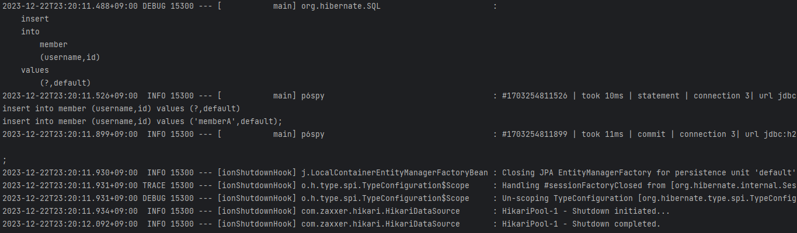

# 실전! 스프링 데이터 JPA

## 프로젝트 환경설정
### 프로젝트 생성
**Project**: Gradle - Groovy Project  
**사용 기능**: web, jpa, h2, lombok  
**groupId**: study  
**artifactId**: data-jpa  

**스프링 부트 3.0**  
1. Java 17 이상을 사용해야 합니다.
2. javax 패키지 이름을 jakarta로 변경해야 합니다.
   - 오라클과 자바 라이센스 문제로 모든 javax 패키지를 jakarta로 변경하기로 했습니다.
3. H2 데이터베이스를 2.1.214 버전 이상 사용해주세요.
   
**패키지 이름 변경 예)**
- JPA 애노테이션
  - `javax.persistence.Entity` -> `jakarta.persistence.Entity`
- 스프링에서 자주 사용하는 @PostConstruct 애노테이션
  - `javax.annotation.PostConstruct` -> `jakarta.annotation.PostConstruct`
- 스프링에서 자주 사용하는 검증 애노테이션
  - `javax.validation` -> `jakarta.validation`

> 참고: 최근 IntelliJ 버전은 Gradle로 실행을 하는 것이 기본 설정이다.  
> 이렇게 하면 실행속도가 느리다. 다음과 같이 변경하면 자바로 바로 실행하므로 좀 더 빨라진다.
> 
> Preferences -> Build, Execution, Deployment -> Build Tools -> Gradle  
> Build and run using: Gradle -> IntelliJ IDEA  
> Run tests using: Gradle -> IntelliJ IDEA  

**롬복 적용**  
1. Preferences plugin lombok 검색 실행 (재시작)
2. Preferences Annotation Processors 검색 Enable annotation processing 체크 (재시작)
3. 임의의 테스트 클래스를 만들고 @Getter, @Setter 확인

**H2 실행 (윈도우)**  
1. cmd > H2 파일로 > `h2.bat` 실행  
   - 권한 주기: chmod 755 h2.sh
2. JDBC URL 에 `jdbc:h2:~/datajpa`(최소 한 번)
3. `~/datajpa.mv.db` 파일 생성 확인
4. `jdbc:h2:tcp://localhost/~/datajpa` 후 접속

> 나는 `jdbc:h2:tcp://localhost/~/jehundatajpa` 이걸로 만듦
---
### 스프링 데이터 JPA와 DB 설정, 동작확인
`application.yml`
```yaml
spring:
  datasource:
    url: jdbc:h2:tcp://localhost/~/jehundatajpa
    username: sa
    password:
    driver-class-name: org.h2.Driver

  jpa:
    hibernate:
      ddl-auto: create
    properties:
      hibernate:
        # show_sql: true
        format_sql: true
logging.level:
  org.hibernate.SQL: debug
# org.hibernate.type: trace
```

실제 동작하는지 확인하기  
**Member 엔티티**
```java
package study.jehundatajpa;

import jakarta.persistence.Entity;
import jakarta.persistence.GeneratedValue;
import jakarta.persistence.GenerationType;
import jakarta.persistence.Id;
import lombok.Getter;
import lombok.Setter;

@Entity
@Getter @Setter
public class Member {

    // (strategy = GenerationType.IDENTITY) 는 H2 버전이 달라서 추가했다.
    @Id @GeneratedValue(strategy = GenerationType.IDENTITY)
    private long id;
    private String username;
}
```

**MemberJpaRepository**
```java
package study.jehundatajpa;

import jakarta.persistence.EntityManager;
import jakarta.persistence.PersistenceContext;
import org.springframework.stereotype.Repository;

@Repository
public class MemberJpaRepository {

    @PersistenceContext
    private EntityManager em;

    public Long save(Member member) {
        em.persist(member);
        return member.getId();
    }

    public Member find(Long id) {
        return em.find(Member.class, id);
    }
}
```

**JPA 기반 테스트**
```java
package study.jehundatajpa;

import jakarta.transaction.Transactional;
import org.assertj.core.api.Assertions;
import org.junit.jupiter.api.Test;
import org.springframework.beans.factory.annotation.Autowired;
import org.springframework.boot.test.context.SpringBootTest;
import org.springframework.test.annotation.Rollback;

@SpringBootTest
@Transactional
@Rollback(false) //테스트 할 때 @Transactional은 자동으로 롤백을 하는데 이 어노테이션으로 바꿀 수 있다.
public class MemberJpaRepositoryTest {

    @Autowired
    MemberJpaRepository memberJpaRepository;
    
    @Test
    public void testMember() throws Exception {
        //given
        Member member = new Member();
        member.setUsername("memberA");

        //when
        Long savedId = memberJpaRepository.save(member);
        Member findMember = memberJpaRepository.find(savedId);

        //then
        Assertions.assertThat(findMember.getId()).isEqualTo(member.getId());
        Assertions.assertThat(findMember.getUsername()).isEqualTo(member.getUsername());

        // findmember와 그냥 member는 같은 것이다. -> JPA 엔티티는 동일성이 보장된다.
        Assertions.assertThat(findMember).isEqualTo(member);
        // System.out.println("findMember == member: ") + (findMember ==member));
    }
}
```

**쿼리 파라미터 로그 남기기 (개발할 때 편하다)**
- 로그에 다음을 추가하기 `org.hibernate.type` : SQL 실행 파라미터를 로그로 남긴다.
- application.yml 에 `org.hibernate.SQL: debug` 아래에 `org.hibernate.type: trace` 추가해서 볼 수 있긴 하다.
- 하지만 외부 라이브러리로 추천하는 것이 있다.

https://github.com/gavlyukovskiy/spring-boot-data-source-decorator  
위의 링크에서 로그를 원하는 형태로 수정해서 application.yml에 넣어 사용할 수 있다.

```
implementation 'com.github.gavlyukovskiy:p6spy-spring-boot-starter:1.9.0'
```
> 참고: 쿼리 파라미터를 로그로 남기는 외부 라이브러리는 시스템 자원을 사용하므로,  
> 개발 단계에서는 편하게 사용해도 된다.  
> 하지만 운영시스템에 적용하려면 꼭 성능테스트를 하고 사용하는 것이 좋다.
> + 스프링 부트 3.0 이상은 라이브러리 버전을 1.9.0 이상을 사용해야 한다.

build.gradle 에 추가
```
dependencies {
    implementation 'org.springframework.boot:spring-boot-starter-data-jpa'
    implementation 'org.springframework.boot:spring-boot-starter-thymeleaf'
    implementation 'org.springframework.boot:spring-boot-starter-web'
    implementation 'com.github.gavlyukovskiy:p6spy-spring-boot-starter:1.9.0'
    compileOnly 'org.projectlombok:lombok'
    runtimeOnly 'com.h2database:h2'
    annotationProcessor 'org.projectlombok:lombok'
    testImplementation 'org.springframework.boot:spring-boot-starter-test'
}
```

실행하면 로그가 이런 형태로 남는다.


