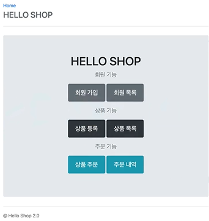
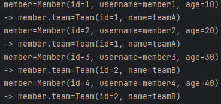
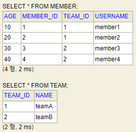
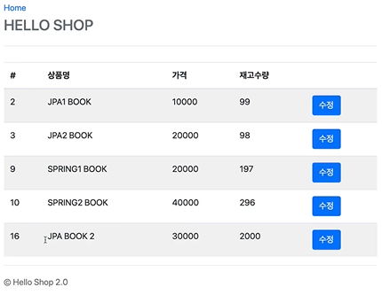
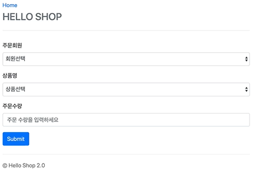
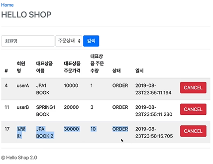

# 도메인 분석 설계

## 요구사항 분석

- 회원 기능
  - 회원 가입
  - 회원 목록
- 상품 기능
  - 상품 등록
  - 상품 수정
  - 상품 조회
- 주문 기능
  - 상품 주문
  - 주문 내역 조회
  - 주문 취소
- 기타 요구사항
  - 상품은 재고 관리가 필요하다.
  - 상품의 종류는 도서, 음반, 영화가 있다.
  - 상품을 카테고리로 구분할 수 있다.
  - 상품 주문시 배송 정보를 입력할 수 있다.

**회원 가입 화면**

**회원 목록 화면**

**상품 등록 화면**

**상품 목록 화면**

**상품 주문 화면**

**주문 내역 화면**

---
## 도메인 모델과 테이블 설계
