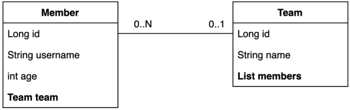
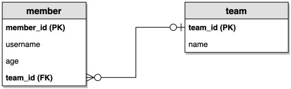
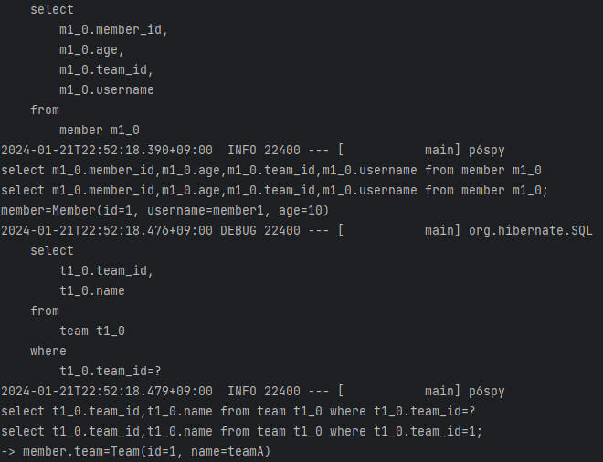

# 예제 도메인 모델

## 예제 도메인 모델과 동작 확인

**엔티티 클래스**  


**ERD**  


핵심이 되는 예제 도메인을 만든다.  
아주 간단한 Member, Team을 만들었다.  
여러 Member가 한 Team에 들어갈 수 있고, Team은 여러 Member를 가지기 때문에 일대다 관계이다.  

**Member 엔티티**
```java
package study.jehundatajpa.entity;

import jakarta.persistence.*;
import lombok.*;

@Entity
@Getter @Setter
@NoArgsConstructor(access = AccessLevel.PROTECTED)
@ToString(of = {"id", "username", "age"})
public class Member {

    @Id @GeneratedValue(strategy = GenerationType.IDENTITY)
    @Column(name = "member_id")
    private long id;
    private String username;
    private int age;

    //일대다 관계
    @ManyToOne(fetch = FetchType.LAZY) // JPA에서 모든 연관관계는 기본적으로 다 지연로딩으로 세팅해야 한다.
    @JoinColumn(name = "team_id")
    private Team team;

    //protected Member() { // JPA는 기본 생성자는 private으로 하면 안 된다. 차라리 이걸 없애고 위에 NoArgsConstructor 어노테이션 추가하자.
    //}

    public Member(String username) {
        this.username = username;
    }

    public void changeTeam(Team team) {
        this.team = team;
        team.getMembers().add(this);
    }
}
```
- 롬복 설명
  - `@Setter` : 실무에서 가급적 Setter는 사용하지 않기
  - `@NoArgsConstructor` `AccessLevel.PROTECTED`: 기본 생성자 막고 싶은데, JPA 스팩상 PROTECTED로 열어두어야 함
  - `@ToString`은 가급적 내부 필드만(연관관계 없는 필드만)
- `changeTeam()` 으로 양방향 연관관계 한 번에 처리 (연관관계 편의 메소드)


**Team 엔티티**
```java
import jakarta.persistence.*;
import lombok.*;

import java.util.ArrayList;
import java.util.List;

@Entity
@Getter @Setter
@NoArgsConstructor(access = AccessLevel.PROTECTED)
@ToString(of = {"id", "name"})
public class Team {

    @Id @GeneratedValue(strategy = GenerationType.IDENTITY)
    @Column(name = "team_id")
    private Long id;
    private String name;

    @OneToMany(mappedBy = "team") // 다대일 관계 foreign key가 없는 쪽에 mappedBy를 적는 것이 좋다.
    private List<Member> members = new ArrayList<>();

    public Team(String name) {
        this.name = name;
    }
}
```
- Member와 Team은 양방향 연관관계, `Member.team` 이 연관관계의 주인, `Team.members` 는 연관관계의
주인이 아님, 따라서 `Member.team` 이 데이터베이스 외래키 값을 변경, 반대편은 읽기만 가능

**데이터 확인 테스트 (MemberTest)**
```java
package study.jehundatajpa.entity;

import jakarta.persistence.EntityManager;
import jakarta.persistence.PersistenceContext;
import org.junit.jupiter.api.Test;
import org.springframework.boot.test.context.SpringBootTest;
import org.springframework.test.annotation.Rollback;
import org.springframework.transaction.annotation.Transactional;

import java.util.List;

@SpringBootTest
@Transactional
@Rollback(false)
public class MemberTest {

    @PersistenceContext
    EntityManager em;

    @Test
    public void testEntity() {
        Team teamA = new Team("teamA");
        Team teamB = new Team("teamB");
        em.persist(teamA);
        em.persist(teamB);

        Member member1 = new Member("member1", 10, teamA);
        Member member2 = new Member("member2", 20, teamA);
        Member member3 = new Member("member3", 30, teamB);
        Member member4 = new Member("member4", 40, teamB);

        em.persist(member1);
        em.persist(member2);
        em.persist(member3);
        em.persist(member4);

        //초기화
        em.flush();
        em.clear();

        //확인
        List<Member> members = em.createQuery("select m from Member m", Member.class)
                .getResultList();

        for (Member member : members) {
            System.out.println("member=" + member);
            System.out.println("-> member.team=" + member.getTeam());
        }
    }
}
```
- 가급적 순수 JPA로 동작 확인 (뒤에서 변경)
- db 테이블 결과 확인 
- 지연 로딩 동작 확인

  
  

위의 사진은 지연로딩이 아닌 즉시로딩으로 되어 있어서 바로 뜬다.  
Member 에서 Team과 ManyToOne 으로 되어있는 부분을 fetch로 지연로딩하게끔 바꿔줬다.  
```java
    //일대다 관계
    @ManyToOne(fetch = FetchType.LAZY) // JPA에서 모든 연관관계는 기본적으로 다 지연로딩으로 세팅해야 한다.
    @JoinColumn(name = "team_id")
    private Team team;
```

**실행 시**  
  
이런 식으로 member1 부터 쿼리가 지연로딩되는 것을 알 수 있다.