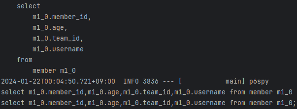
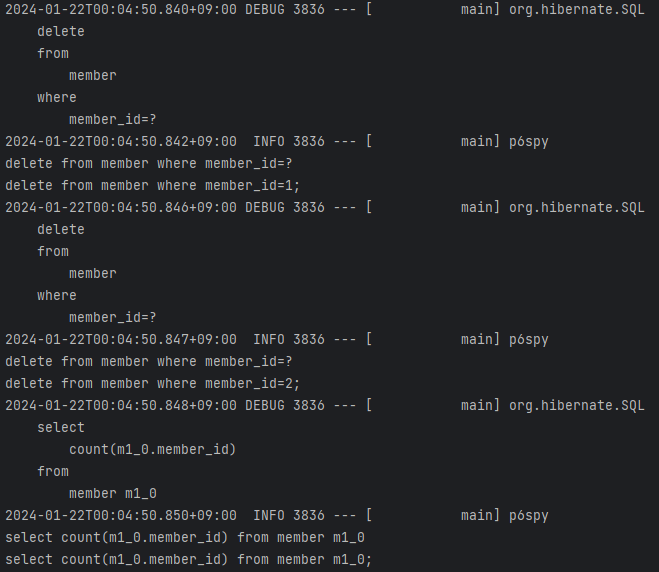

# 공통 인터페이스 기능
- 순수 JPA 기반 리포지토리 만들기
- 스프링 데이터 JPA 공통 인터페이스 소개
- 스프링 데이터 JPA 공통 인터페이스 활용

## 순수 JPA 기반 리포지토리 만들기
- 기본 CRUD
  - 저장
  - 변경 -> 변경감지 사용
  - 삭제
  - 전체 조회
  - 단건 조회
  - 카운트

> 참고: JPA에서 수정은 변경감지 기능을 사용하면 된다.  
> 트랜잭션 안에서 엔티티를 조회한 다음에 데이터를 변경하면, 트랜잭션 종료 시점에 변경감지 기능이 작동해서 변경된 엔티티를 감지하고 UPDATE SQL을 실행한다.  

**순수 JPA 기반 리포지토리 - 회원 (MemberJpaRepository)**
```java
package study.jehundatajpa.repository;

import jakarta.persistence.EntityManager;
import jakarta.persistence.PersistenceContext;
import org.springframework.stereotype.Repository;
import study.jehundatajpa.entity.Member;

import java.util.List;
import java.util.Optional;

@Repository
public class MemberJpaRepository {

    @PersistenceContext
    private EntityManager em;

    public Member save(Member member) {
        em.persist(member);
        return member;
    }

    public void delete(Member member) {
        em.remove(member);
    }

    public List<Member> findAll() {
        return em.createQuery("select m from Member m", Member.class)
                .getResultList();
    }

    public Optional<Member> findById(Long id) {
        Member member = em.find(Member.class, id);
        return Optional.ofNullable(member);
    }

    public long count() {
        return em.createQuery("select count(m) from Member m", Long.class)
                .getSingleResult();
    }

    public Member find(Long id) {
        return em.find(Member.class, id);
    }
}
```
- JPA는 변경(수정) 할 때 '변경 감지'라는 기능으로 하기 때문에 update 에 대한 기능이 필요없다.


**순수 JPA 기반 리포지토리 - 팀 (TeamJpaRepository)**
```java
package study.jehundatajpa.repository;

import org.springframework.stereotype.Repository;
import study.jehundatajpa.entity.Team;

import jakarta.persistence.EntityManager;
import jakarta.persistence.PersistenceContext;
import java.util.List;
import java.util.Optional;

@Repository
public class TeamJpaRepository {
    
    @PersistenceContext
    private EntityManager em;
    
    public Team save(Team team) {
        em.persist(team);
        return team;
    }
    
    public void delete(Team team) {
        em.remove(team);
    }
    
    public List<Team> findAll() {
        return em.createQuery("select t from Team t", Team.class)
                .getResultList();
    }
    
    public Optional<Team> findById(Long id) {
        Team team = em.find(Team.class, id);
        return Optional.ofNullable(team);
    }
    
    public long count() {
        return em.createQuery("select count(t) from Team t", Long.class)
                .getSingleResult();
    }
    
}
```

- 회원 리포지토리와 거의 동일하다.

**순수 JPA 기반 리포지토리 테스트 (MemberJpaRepository 에 추가)**
```java
import static org.assertj.core.api.Assertions.assertThat;

    @Test
    public void basicCRUD() {

        Member member1 = new Member("member1");
        Member member2 = new Member("member2");
        memberJpaRepository.save(member1);
        memberJpaRepository.save(member2);

        //단건 조회 검증
        Member findMember1 = memberJpaRepository.findById(member1.getId()).get();
        Member findMember2 = memberJpaRepository.findById(member2.getId()).get();
        assertThat(findMember1).isEqualTo(member1);
        assertThat(findMember2).isEqualTo(member2);
        
        //리스트 조회 검증
        List<Member> all = memberJpaRepository.findAll();
        assertThat(all.size()).isEqualTo(2);
        
        //카운트 검증
        long count = memberJpaRepository.count();
        assertThat(count).isEqualTo(2);
        
        //삭제 검증
        memberJpaRepository.delete(member1);
        memberJpaRepository.delete(member2);
        long deletedCount = memberJpaRepository.count();
        assertThat(deletedCount).isEqualTo(0);
    }
```
- 기본 CRUD를 검증한다.

**단건 조회**  
  

**리스트 조회**  


**카운트 검증**  


**삭제 후 카운트 검증**  


---
## 공통 인터페이스 설정

**JavaConfig 설정- 스프링 부트 사용시 생략 가능**
```java
@Configuration
@EnableJpaRepositories(basePackages = "jpabook.jpashop.repository")
public class AppConfig {}
```
- 스프링 부트 사용시 `@SpringBootApplication` 위치를 지정(해당 패키지와 하위 패키지 인식)
- 만약 위치가 달라지면 `@EnableJpaRepositories` 필요

현재 Application 에서는 `@SpringBOotApplication` 을 사용 중이기에 하지 않아도 된다.  

**스프링 데이터 JPA가 구현 클래스를 대신 생성해준다.**  
  
- `org.springframework.data.repository.Repository` 를 구현한 클래스는 스캔 대상 
  - MemberRepository 인터페이스가 동작한 이유 
  - 실제 출력해보기(Proxy)
  - memberRepository.getClass() -> class com.sun.proxy.$ProxyXXX
  - 
- `@Repository` 애노테이션 생략 가능 
  - 컴포넌트 스캔을 스프링 데이터 JPA가 자동으로 처리 
  - JPA 예외를 스프링 예외로 변환하는 과정도 자동으로 처리

---
## 공통 인터페이스 적용
순수 JPA로 구현한 `MemberJpaRepository` 대신에 스프링 데이터 JPA가 제공하는 공통 인터페이스 사용  

이미 하긴 했다.  

**스프링 데이터 JPA 기반 MemberRepository**
```java
public interface MemberRepository extends JpaRepository<Member, Long> {
}
```


이전에 한 JPA를 가지고 테스트하는 것이 아닌 다른 MemberRepository 테스트를 해보자.
**MemberRepository 테스트**
```java
package study.jehundatajpa.repository;

import jakarta.transaction.Transactional;
import org.assertj.core.api.Assertions;
import org.junit.jupiter.api.Test;
import org.springframework.beans.factory.annotation.Autowired;
import org.springframework.boot.test.context.SpringBootTest;
import org.springframework.test.annotation.Rollback;
import study.jehundatajpa.entity.Member;

import java.util.List;

import static org.assertj.core.api.Assertions.assertThat;

@SpringBootTest
@Transactional
@Rollback(false) //테스트 할 때 @Transactional은 자동으로 롤백을 하는데 이 어노테이션으로 바꿀 수 있다.
public class MemberRepositoryTest {

    @Autowired
    MemberRepository memberRepository;

    @Test
    public void testMember() {
        Member member = new Member("memberA");
        Member savedMember = memberRepository.save(member);
        Member findMember = memberRepository.findById(savedMember.getId()).get();
        
        Assertions.assertThat(findMember.getId()).isEqualTo(member.getId());
        Assertions.assertThat(findMember.getUsername()).isEqualTo(member.getUsername());
        Assertions.assertThat(findMember).isEqualTo(member); //JPA 엔티티 동일성 보장
    }
    
    @Test
    public void basicCRUD() {
        
        Member member1 = new Member("member1");
        Member member2 = new Member("member2");
        memberRepository.save(member1);
        memberRepository.save(member2);
        
        //단건 조회 검증
        Member findMember1 = memberRepository.findById(member1.getId()).get();
        Member findMember2 = memberRepository.findById(member2.getId()).get();
        assertThat(findMember1).isEqualTo(member1);
        assertThat(findMember2).isEqualTo(member2);
        
        //리스트 조회 검증
        List<Member> all = memberRepository.findAll();
        assertThat(all.size()).isEqualTo(2);
        
        //카운트 검증
        long count = memberRepository.count();
        assertThat(count).isEqualTo(2);
        
        //삭제 검증
        memberRepository.delete(member1);
        memberRepository.delete(member2);
        long deletedCount = memberRepository.count();
        assertThat(deletedCount).isEqualTo(0);
        
    }
}
```

기존 순수 JPA 기반 테스트에서 사용했던 코드를 그대로 스프링 데이터 JPA 리포지토리 기반 테스트로 변경해도 동일한 방식으로 동작한다.

**TeamRepository 생성**도 이전 커밋에서 하긴 했다.
```java
package study.jehundatajpa.repository;

import org.springframework.data.jpa.repository.JpaRepository;
import study.jehundatajpa.entity.Team;

public interface TeamRepository extends JpaRepository<Team, Long> {
}

```
- TeamRepository는 테스트 생략
- Generic
  - T: 엔티티 타입
  - ID: 식별자 타입(PK)

---