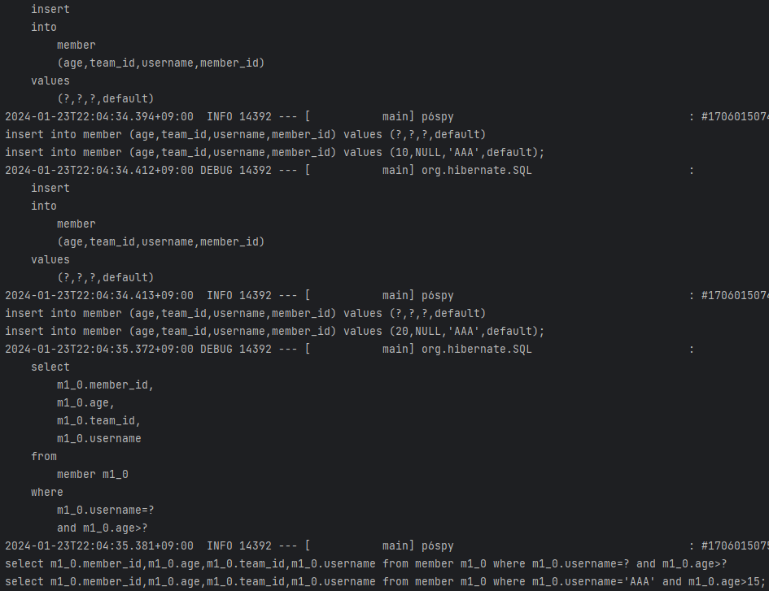

# 쿼리 메소드 기능

- 메소드 이름으로 쿼리 생성
- NamedQuery
- @Query - 리파지토리 메소드에 쿼리 정의
- 파라미터 바인딩
- 반환 타입
- 페이징과 정렬
- 벌크성 수정 쿼리
- @EntityGraph

스프링 데이터 JPA가 제공하는 마법 같은 기능

**쿼리 메소드 기능 3가지**  
- 메소드 이름으로 쿼리 생성
- 메소드 이름으로 JPA NamedQuery 호출
- `@Query` 어노테이션을 사용해서 리파지토리 인터페이스에 쿼리 직접 정의

---
## 메소드 이름으로 쿼리 생성
메소드 이름을 분석해서 JPQL 쿼리 실행  

이름과 나이를 기준으로 회원을 조회하려면?  

**순수 JPA 리포지토리 (MemberJpaRepository 에 추가)**
```java
    public List<Member> findByUsernameAndAgeGreaterThan(String username, int age) {
        return em.createQuery("select m from Member m where m.username = :username and m.age > :age")
                .setParameter("username", username)
                .setParameter("age", age)
                .getResultList();
    }
```

**순수 JPA 테스트 코드 (MemberJpaRepositoryTest에 추가)**
```java
    // 메소드 이름으로 쿼리 생성 (메소드 이름을 분석해서 JPQL 쿼리 실행)
    // 이름과 나이 기준으로 회원 조회
    @Test
    public void findByUsernameAndAgeGreaterThan() {
        Member m1 = new Member("AAA", 10);
        Member m2 = new Member("AAA", 20);

        memberJpaRepository.save(m1);
        memberJpaRepository.save(m2);

        List<Member> result = memberJpaRepository.findByUsernameAndAgeGreaterThan("AAA", 15);

        assertThat(result.get(0).getUsername()).isEqualTo("AAA");
        assertThat(result.get(0).getAge()).isEqualTo(20);
        assertThat(result.size()).isEqualTo(1);
    }
```

  
로그를 보면 쿼리로도 잘 나오는 것을 알 수 있다.  

문제는 사실 내가 코드를 짜야 한다는 것이다. (메소드 이름만 봐도 대충 뭔지 아는데.)  
이 문제를 JPA가 해결해준다. 아래 코드대로 해보자.

**스프링 데이터 JPA**
```java
public interface MemberRepository extends JpaRepository<Member, Long> {
    List<Member> findByUsernameAndAgeGreaterThan(String username, int age);
}
```
이렇게만 넣고 MemberJpaRepositoryTest 가 아닌, MemberRepositoryTest에 테스트해보자.  

```java
    @Test
    public void findByUsernameAndAgeGreaterThan() {
        Member m1 = new Member("AAA", 10);
        Member m2 = new Member("AAA", 20);

        memberRepository.save(m1);
        memberRepository.save(m2);

        List<Member> result = memberRepository.findByUsernameAndAgeGreaterThan("AAA", 15);

        assertThat(result.get(0).getUsername()).isEqualTo("AAA");
        assertThat(result.get(0).getAge()).isEqualTo(20);
        assertThat(result.size()).isEqualTo(1);
    }
```

JpaRepository 에서 했던 것과 마찬가지로 결과가 나온다.
- 스프링 데이터 JPA는 메소드 이름을 분석해서 JPQL을 생성하고 실행
- ex) 이름을 `UsernameAndAge` 라고 하면 `And` 때문에 `Username`, `age` 2개로 묶게끔 한다.
  - 추가로 `UsernameAndAgeGreaterThan` 에서 Username 은 같은지 `equal` 로 확인하고, Age는 GreaterThan 이므로 더 큰지 확인하는 메소드로 분석한다.

**쿼리 메소드 필터 조건**
- 스프링 데이터 JPA 공식 문서 참고: (https://docs.spring.io/spring-data/jpa/docs/current/reference/html/#jpa.query-methods.query-creation)

**스프링 데이터 JPA가 제공하는 쿼리 메소드 기능**
- 조회: find…By ,read…By ,query…By get…By
  - https://docs.spring.io/spring-data/jpa/docs/current/reference/html/#repositories.query-methods.query-creation
  - 예:) findHelloBy 처럼 ...에 식별하기 위한 내용(설명)이 들어가도 된다.
- COUNT : count…By 반환타입 `long`
- EXISTS : exists…By 반환타입 `boolean` 
- 삭제 : delete…By, remove…By 반환타입 `long` 
- DISTINCT : findDistinct, findMemberDistinctBy 
- LIMIT : findFirst3, findFirst, findTop, findTop3
  - https://docs.spring.io/spring-data/jpa/docs/current/reference/html/#repositories.limit-query-result

> 참고: 이 기능은 엔티티의 필드명이 변경되면 인터페이스에 정의한 메서드 이름도 꼭 함께 변경해야 한다. 그렇지 않으면 애플리케이션을 시작하는 시점에 오류가 발생한다.  
> 이렇게 애플리케이션 로딩 시점에 오류를 인지할 수 있는 것이 스프링 데이터 JPA의 매우 큰 장점이다.  

---

## JPA NamedQuery
(거의 실무에서 쓸 일은 없다.)  
JPA의 NamedQuery를 호출할 수 있음  

`NamedQuery` 어노테이션으로 Named 쿼리 정의
```java
@Entity
@NamedQuery(
        name="Member.findByUsername",
        query="select m from Member m where m.username = :username")
public class Member {
    ...
}
```

**JPA를 직접 사용해서 Named 쿼리 호출** 
```java
public class MemberRepository {

    public List<Member> findByUsername(String username) {
        ...
        List<Member> resultList =
                em.createNamedQuery("Member.findByUsername", Member.class)
                        .setParameter("username", username)
                        .getResultList();
    }
}
```

**스프링 데이터 JPA로 NamedQuery 사용** 
```java
@Query(name = "Member.findByUsername") // 이 어노테이션은 생략해도 메서드 이름만으로 쿼리 호출 가능
List<Member> findByUsername(@Param("username") String username);
```

`@Query` 를 생략하고 메서드 이름만으로 Named 쿼리를 호출할 수 있다.

스프링 데이터 JPA로 Named 쿼리 호출**
```java
public interface MemberRepository extends JpaRepository<Member, Long> { //** 여기 선언한 Member 도메인 클래스
    List<Member> findByUsername(@Param("username") String username);
}
```
- 스프링 데이터 JPA는 선언한 "도메인 클래스 + .(점) + 메서드 이름"으로 Named 쿼리를 찾아서 실행 
- 만약 실행할 Named 쿼리가 없으면 메서드 이름으로 쿼리 생성 전략을 사용한다. 
- 필요하면 전략을 변경할 수 있지만 권장하지 않는다. 
  - 참고: https://docs.spring.io/spring-data/jpa/docs/current/reference/html/#repositories.query-methods.query-lookup-strategies

> 참고: 스프링 데이터 JPA를 사용하면 실무에서 Named Query를 직접 등록해서 사용하는 일은 드물다. 대신 `@Query` 를 사용해서 리파지토리 메소드에 쿼리를 직접 정의한다.

---
